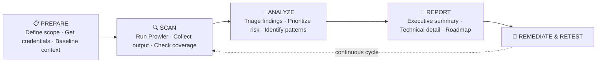
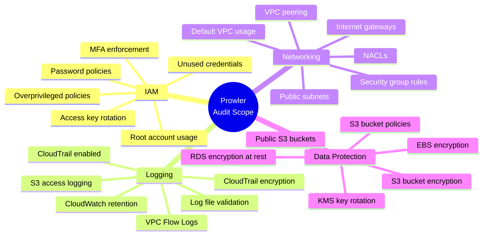
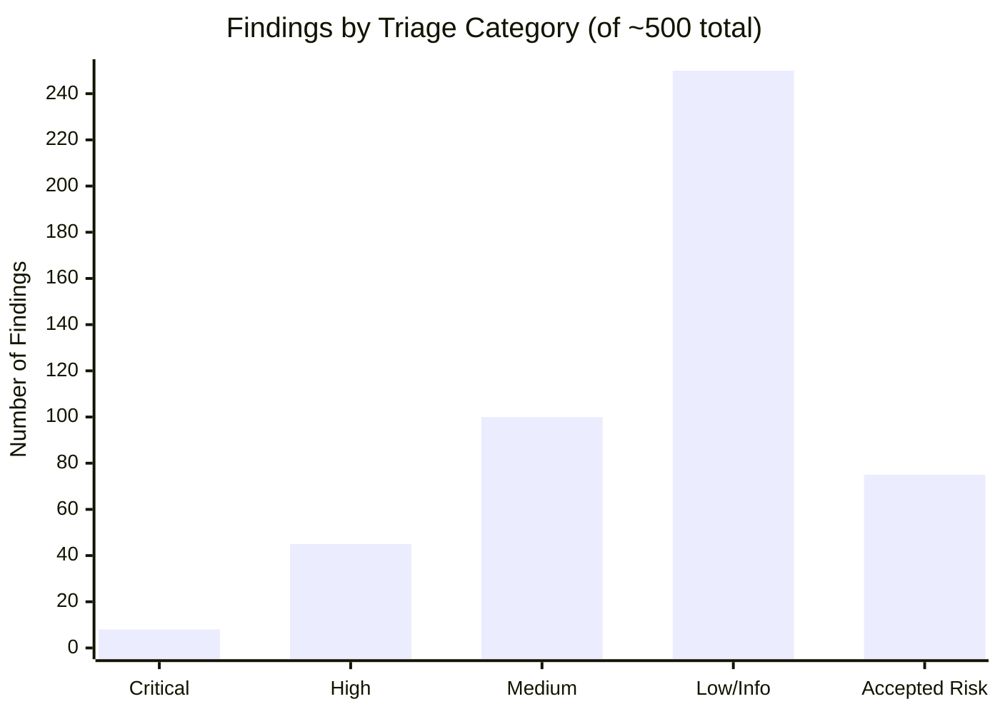
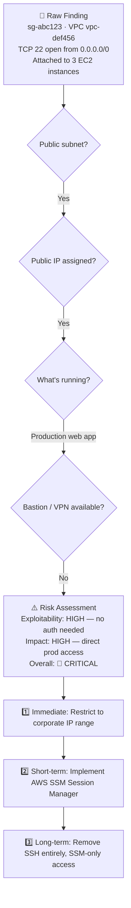
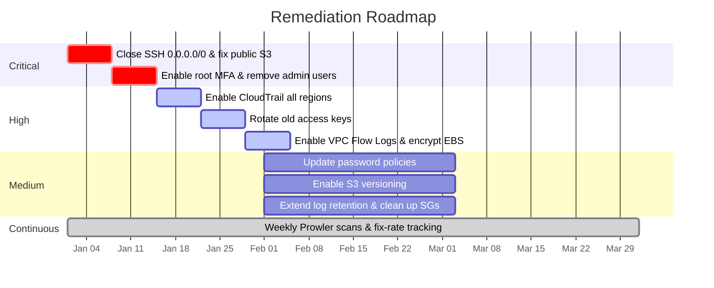

<div align="center">

# ☁️ Cloud Security Audit & Compliance Assessment

**Risk Prioritization · Evidence-Based Findings · Executive Communication**


*A fictional GRC case study simulating a cloud security audit for a payment processing environment.*

</div>

---

## 📌 At a Glance

| | |
|---|---|
| **GRC Domain** | Cloud Security Audit, Risk Prioritization, Compliance Controls |
| **Role Simulated** | Senior GRC Security Auditor / Cloud Security Lead |
| **Frameworks Mapped** | CIS AWS Foundations Benchmark v1.5.0 · PCI-DSS v4.0 · SOC 2 TSC |
| **Scenario** | *Apex Cloud Financial Systems (ApexPay)* — Cloud Payment Processor |
| **Project Type** | Fictional Portfolio Case Study |

### 📂 Key Deliverables

| Deliverable | Description | Link |
|---|---|---|
| 📊 Audit Data Output | Raw Prowler scan results | [`reports/prowler_audit_summary.json`](./reports/prowler_audit_summary.json) |
| 📋 Findings & Risk Matrix | Triaged findings, severity-ranked | [`reports/findings_matrix.csv`](./reports/findings_matrix.csv) |
| 📑 CISO Executive Summary | Non-technical leadership briefing | [`docs/executive_summary.md`](./docs/executive_summary.md) |
| 🔎 Simulated Evidence Pack | Supporting audit evidence | [`evidence/SIMULATED_EVIDENCE_PACK.md`](./evidence/SIMULATED_EVIDENCE_PACK.md) |
| 🛠️ Remediation Guide | Fix guidance by severity | [`remediation/REMEDIATION_GUIDE.md`](./remediation/REMEDIATION_GUIDE.md) |
| 💬 Auditor Challenge Q&A | Defends judgment calls under scrutiny | [`docs/auditor_challenge_qa.md`](./docs/auditor_challenge_qa.md) |

---

## 🎯 Overview

Running a cloud security scanner is easy. **Interpreting the output is the actual job.**

This project uses [Prowler](https://docs.prowler.cloud/) to scan a simulated AWS environment across IAM, logging, networking, and data protection — then demonstrates the harder skill: turning hundreds of raw findings into a prioritized, defensible, business-relevant risk narrative.

---

## 🔄 Audit Lifecycle



---

## 🧭 What Prowler Checks



---

## 🚦 Signal vs. Noise: Triage Breakdown

A raw scan returned **~500 findings.** Here's how they broke down after triage — this distribution is the difference between a report nobody reads and one leadership actually acts on.



| Tier | Volume | Timeline | Examples |
|---|---|---|---|
| 🔴 **Critical** | ~5–10 | Fix immediately | Public S3 with sensitive data · Root account without MFA · Admin IAM user with no MFA · SSH/RDP open to `0.0.0.0/0` |
| 🟠 **High** | ~20–50 | Fix this sprint | CloudTrail not enabled in all regions · Access keys >90 days old · Unencrypted EBS volumes · No VPC Flow Logs |
| 🟡 **Medium** | ~50–100 | Fix this quarter | Password policy lacks symbols · S3 versioning disabled · Log retention <1 year |
| ⚪ **Low / Informational** | ~200+ | Backlog | Non-opted-in region usage · Unused default VPC · Minor logging best practices |
| ✅ **Accepted Risk** | ~50–100 | Document & move on | Check doesn't apply · Compensating control exists · Cost/benefit doesn't justify fix |

---

## 🎯 Risk Prioritization Matrix

Every finding is scored on **exploitability × impact** — not severity labels alone — to decide what actually gets fixed first.

| Impact ↓ / Exploitability → | Low | Medium | High |
|---|---|---|---|
| **High** | Medium | High | 🔴 **Critical** |
| **Medium** | Low | Medium | High |
| **Low** | Info | Low | Medium |

**Exploitability factors:** publicly accessible? known exploit exists? skill required? authentication needed?
**Impact factors:** data sensitivity · regulatory implications · business criticality · blast radius

---

## 🔬 Example Finding Analysis

**Finding:** Security group allows SSH from `0.0.0.0/0`



---

## 📝 Accepted Risk Documentation — Sample

> A well-run audit doesn't just list problems — it shows where risk was **consciously and defensibly accepted.**

| Field | Value |
|---|---|
| **Finding ID** | `prowler-iam-16` |
| **Description** | IAM password policy does not require uppercase characters |
| **Severity** | Low |
| **Decision** | ✅ Accept Risk |
| **Review Date** | 2026-06-01 |
| **Approved By** | Security Team |

**Justification:**
- All IAM users have MFA enforced (compensating control)
- Minimum password length is 16 characters
- Most access is via SSO, not IAM passwords
- NIST 800-63B no longer recommends complexity requirements

**Compensating controls:** MFA required on all accounts · 90-day password rotation · account lockout after 5 failed attempts

---

## 📁 Project Structure

```
04-cloud-security-audit/
├── README.md
├── reports/
│   ├── sample-prowler-output.json     # Raw Prowler output
│   ├── executive-summary.md           # High-level findings
│   └── detailed-findings.md           # Technical details
├── remediation/
│   ├── critical-findings.md           # Immediate action items
│   ├── high-findings.md               # Sprint-level items
│   ├── medium-findings.md             # Quarter-level items
│   └── accepted-risks.md              # Documented exceptions
├── scripts/
│   ├── run-prowler.sh                 # Prowler execution script
│   └── parse-results.py               # Results parsing helper
└── docs/
    ├── methodology.md                 # How the audit was conducted
    └── compliance-mapping.md          # Maps to CIS, SOC 2, etc.
```

---

## 🗺️ Remediation Roadmap



---

## ✅ Deliverables Checklist

- [x] Prowler scan results (JSON and HTML)
- [x] Executive summary for non-technical audience
- [x] Detailed findings with context
- [x] Prioritized remediation list
- [x] Accepted risk documentation
- [x] Remediation roadmap
- [x] Before/after comparison (post-remediation)
- [x] Compliance mapping (CIS, SOC 2, etc.)

---

## ❓ Questions Answered in This Documentation

1. How do you distinguish between signal and noise?
2. Which findings actually matter in this context?
3. What would be accepted risks in a real organization?
4. How would you prioritize remediation over time?
5. What compensating controls might justify accepting a risk?
6. How would you present this to non-technical leadership?

---

## 🧠 Demonstrating Judgment

| Junior Approach | Senior Approach |
|---|---|
| *"Prowler found 500 issues. All need to be fixed."* | *"Prowler identified 500 findings. After analysis: 8 are critical — public S3 and open SSH, fixing this week. 45 are high — mostly logging gaps, remediation plan attached. 120 are context-dependent and need business input. 200+ are informational or don't apply to our setup. Here's my recommended roadmap."* |

> **The difference is judgment, not technical ability.** Anyone can run a scanner. Professionals interpret results, prioritize by real-world risk, and communicate trade-offs to people who don't read JSON.

---

## 📚 Further Reading

- [Prowler Documentation](https://docs.prowler.cloud/)
- [CIS AWS Foundations Benchmark](https://www.cisecurity.org/benchmark/amazon_web_services)
- [AWS Well-Architected Security Pillar](https://docs.aws.amazon.com/wellarchitected/latest/security-pillar/welcome.html)

---

<div align="center">

**This project demonstrates judgment, not just technical ability.** In real jobs, security professionals are constantly asked to prioritize and explain risk — not just list vulnerabilities.

</div>
